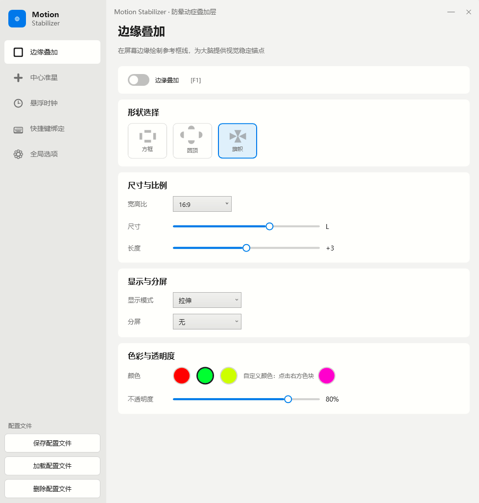
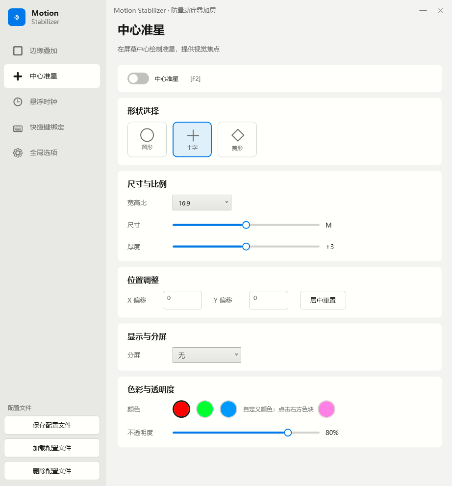
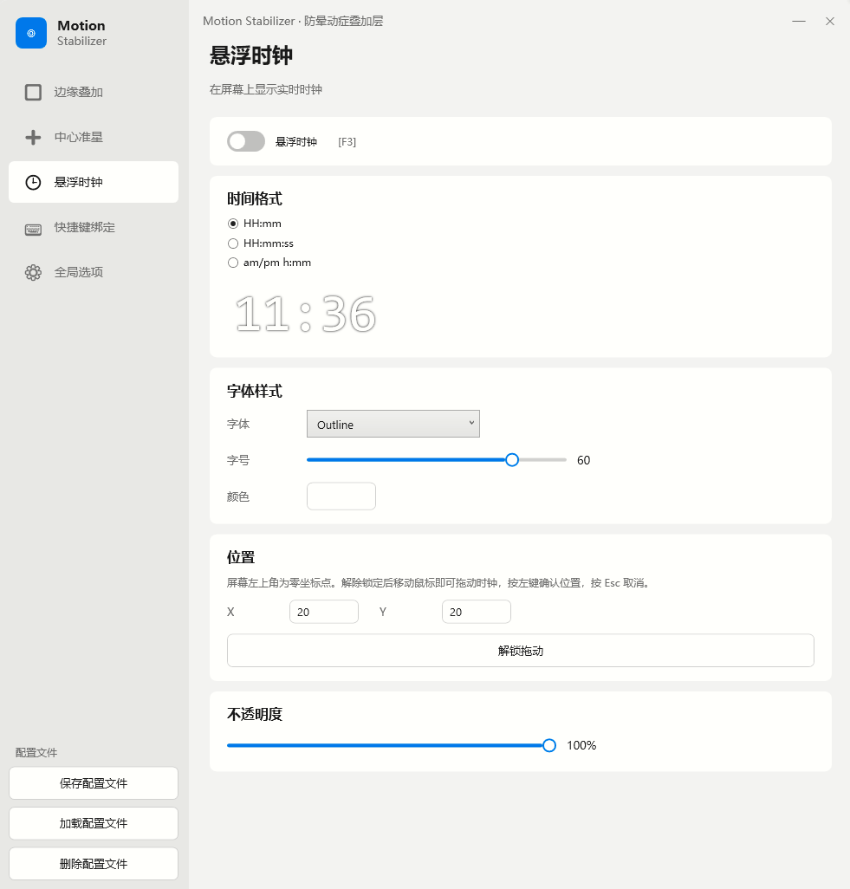
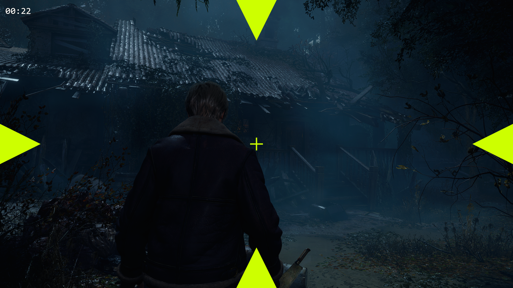

# Motion Stabilizer · 防晕动症叠加层

> 安全、零侵入的视觉稳定叠加层，缓解 3D 游戏晕动症。
>
> A safe, zero-intrusion visual stabilization overlay for 3D game motion sickness relief.

## 📸 界面演示 / Screenshots

<table>
  <tr>
    <td align="center"><b>边缘叠加 / Edge Overlay</b></td>
    <td align="center"><b>中心准星 / Crosshair</b></td>
  </tr>
  <tr>
    <td></td>
    <td></td>
  </tr>
  <tr>
    <td align="center"><b>悬浮时钟 / Floating Clock</b></td>
    <td align="center"><b>游戏实测 / In-Game Test</b></td>
  </tr>
  <tr>
    <td></td>
    <td></td>
  </tr>
</table>

## ✨ 功能特性 / Features

- **边缘叠加 (Edge Overlay)** — 在屏幕边缘绘制参考框线（方框 / 圆顶 / 旗帜三种形状），为大脑提供视觉稳定锚点
- **中心准星 (Crosshair)** — 在屏幕中心绘制准星，提供视觉焦点
- **悬浮时钟 (Floating Clock)** — 可拖动的实时时钟，支持多种时间格式和描边字体
- **全局快捷键 (Global Hotkeys)** — 在游戏中随时切换设置，支持 F1-F10 等快捷键
- **多语言支持** — 中文 / English
- **配置文件管理** — 保存 / 加载 / 删除自定义配置方案

## 🔒 安全性 / Safety

- ✓ 纯外部桌面叠加层 — 无 DLL 注入
- ✓ 兼容所有反作弊系统（Vanguard、EAC、BattlEye）
- ✓ 不修改游戏文件，不访问内存

## 📋 系统要求 / Requirements

- Windows 10/11 (64-bit)
- 直接下载版无需安装 .NET 运行时（已内置）
- 从源码构建需要 [.NET 8.0 SDK](https://dotnet.microsoft.com/download/dotnet/8.0)

## 🚀 快速开始 / Getting Started

### 方式一：直接下载（推荐）/ Download (Recommended)

1. 前往 [Releases 页面](https://github.com/shsr07/MotionStabilizer/releases)
2. 下载 `MotionStabilizer-v1.2.0-win-x64.zip`
3. 解压到任意目录
4. 双击 `MotionStabilizer.exe` 即可运行

> 无需安装 .NET 运行时，已内置。

### 方式二：从源码构建 / Build from Source

```bash
git clone https://github.com/shsr07/MotionStabilizer.git
cd MotionStabilizer
dotnet build -c Release
```

构建产物位于 `MotionStabilizer/bin/Release/net8.0-windows/`。

## 📖 使用说明 / Usage

1. 启动程序后，主窗口会在系统托盘和任务栏显示
2. 通过左侧导航栏配置边缘叠加、中心准星、悬浮时钟
3. 在"快捷键绑定"页面设置全局快捷键
4. 在"全局选项"页面调整界面、语言和配置文件
5. 最小化窗口后程序驻留托盘，叠加层持续运行

> ⚠️ **注意事项**：部分游戏的全屏独占模式（Exclusive Fullscreen）下叠加层可能无法显示。请将游戏切换为**无边框窗口模式**或**窗口模式**即可正常使用。

## ⌨️ 默认快捷键 / Default Hotkeys

| 快捷键 | 功能 |
|--------|------|
| F1 | 开关边缘叠加 |
| F2 | 开关中心准星 |
| F3 | 开关悬浮时钟 |
| F4 | 切换叠加形状 |
| F5 | 切换准星形状 |
| F6 | 切换显示模式 |
| F7-F10 | 切换颜色（红/绿/黄/自定义） |

## 🛠️ 技术栈 / Tech Stack

- **.NET 8.0** + **WPF** (Windows Presentation Foundation)
- **Win32 API** — 点击穿透窗口、全局热键注册、系统托盘
- **C# 12** — 最新 C# 特性

## 📁 项目结构 / Project Structure

```
MotionStabilizer/
├── Models/              # 数据模型 (配置、枚举)
├── Overlay/             # 叠加层渲染窗口与逻辑
├── Resources/           # 多语言字符串资源
├── Services/            # 配置管理、热键管理、托盘服务、Win32 互操作
├── Themes/              # WPF 全局样式
├── Views/               # 设置页面 (叠加层、准星、时钟、快捷键、选项)
│   └── Dialogs/         # 自定义对话框
├── App.xaml(.cs)        # 应用入口
└── MainWindow.xaml(.cs) # 主窗口
```

## 📄 许可证 / License

[MIT License](LICENSE) © 2025 shsr07

## 👤 作者 / Author

- **GitHub:** [shsr07](https://github.com/shsr07)
