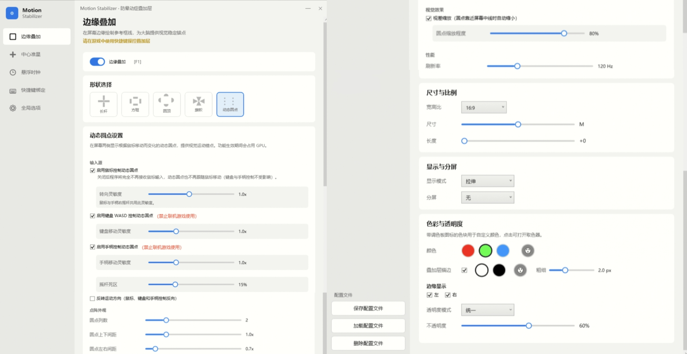
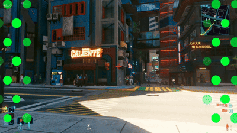
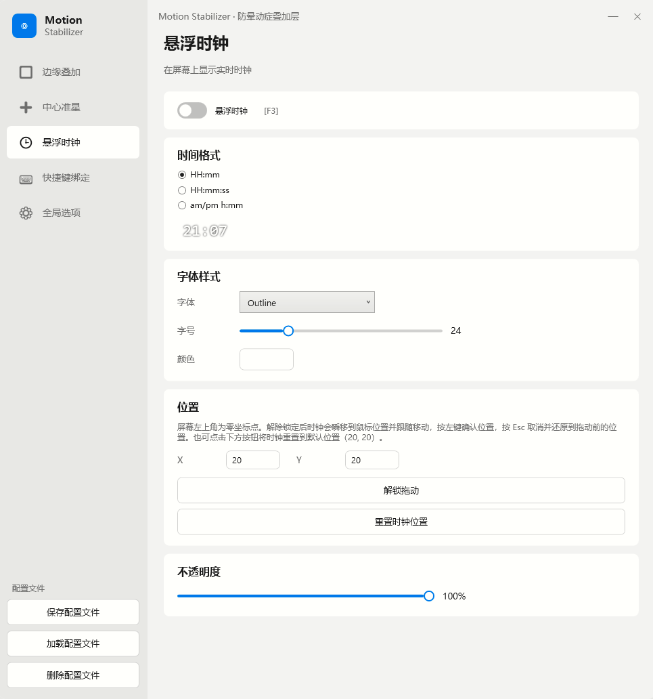
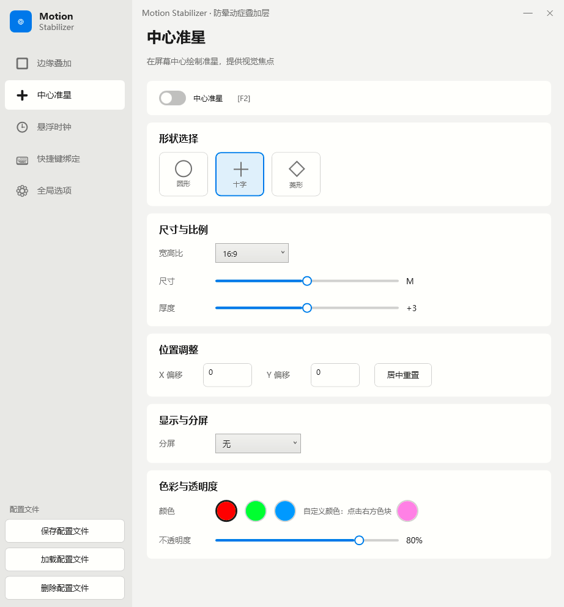

# Motion Stabilizer · 防晕动症叠加层

[](https://github.com/shsr07/MotionStabilizer/actions)

> 安全、零侵入的视觉稳定叠加层，缓解 3D 游戏晕动症。
>
> A safe, zero-intrusion visual stabilization overlay for 3D game motion sickness relief.

## 📸 界面演示 / Screenshots

<table>
  <tr>
    <td align="center"><b>边缘叠加 / Edge Overlay</b></td>
    <td align="center"><b>游戏实测 / In-Game Test</b></td>
  </tr>
  <tr>
    <td></td>
    <td></td>
  </tr>
  <tr>
    <td align="center"><b>悬浮时钟 / Floating Clock</b></td>
    <td align="center"><b>中心准星 / Crosshair</b></td>  
  </tr>
  <tr>
    <td></td>
    <td></td>
  </tr>
</table>

## ✨ 功能特性 / Features

- **边缘叠加 (Edge Overlay)** — 在屏幕边缘绘制参考框线（方框 / 圆顶 / 旗帜三种形状），为大脑提供视觉稳定锚点

> [!TIP]
> **核心功能(Core Features)：动态圆点 (Motion Dots)**
>
> 本质是极简的人工光流刺激，专门向你的周边视觉补充"身体正在运动"的视觉证据，让视觉信号与内耳前庭的平衡信号对齐，从根源缓解感官冲突。
>
> - **运动方向反转** — 可反转鼠标和键盘控制方向，适应不同游戏视角
> - **视差缩放** — 圆点靠近屏幕中线时自动缩小，营造自然的运动景深感
> - **可配置刷新率** — 30–360 Hz 自定义动画刷新率，匹配你的显示器

- **中心准星 (Crosshair)** — 在屏幕中心绘制准星，提供视觉焦点
- **悬浮时钟 (Floating Clock)** — 可拖动的实时时钟，支持多种时间格式和描边字体
- **全局快捷键 (Global Hotkeys)** — 在游戏中随时切换设置，支持 F1–F11 等快捷键
- **多显示器支持 (Multi-Monitor)** — 自动识别所有显示器，支持在全局选项中选择**目标显示器**（仅在该屏渲染叠加层），边缘叠加、动态圆点和准星在多屏环境下正确定位与渲染，支持混合 DPI 显示器（PerMonitorV2）
- **多语言支持** — 中文 / English
- **配置文件管理** — 保存 / 加载 / 删除自定义配置方案，修改即自动保存

## 🔒 安全性 / Safety

- ✓ 纯外部桌面叠加层 — 无 DLL 注入
- ✓ 不修改游戏文件，不访问内存
- ✓ 反作弊兼容性：
  - 默认模式（仅鼠标 Raw Input）：与所有反作弊系统兼容，零风险
  - WASD 键盘控制（可选）：使用 GetAsyncKeyState 标准 API，风险极低，但建议仅用于单机游戏
  - 本工具采用 Raw Input 只读旁路方式，不拦截输入、不修改输入流、不增加延迟，安全性高

## 📋 系统要求 / Requirements

- Windows 10/11 (64-bit)
- 直接下载版无需安装 .NET（已内置）
- 从源码构建需要 [.NET 8.0 SDK](https://dotnet.microsoft.com/download/dotnet/8.0)

## 🚀 快速开始 / Getting Started

### 方式一：直接下载（推荐）/ Download (Recommended)

1. 前往 [Releases 页面](https://github.com/shsr07/MotionStabilizer/releases)
2. 下载 `MotionStabilizer-v2.6.0-win-x64.zip`
3. 解压到任意目录
4. 双击 `MotionStabilizer.exe` 即可运行

> 无需安装 .NET 运行时，已内置。

> **校验 / Checksum (v2.6.0)**
>
> SHA-256: `（待更新 / TBA）`
>
> 验证方式 / Verify:
> - Windows: `certutil -hashfile MotionStabilizer-v2.6.0-win-x64.zip SHA256`

### 方式二：从源码构建 / Build from Source

```bash
git clone https://github.com/shsr07/MotionStabilizer.git
cd MotionStabilizer
dotnet build -c Release
```

构建产物位于 `MotionStabilizer/bin/Release/net8.0-windows/`。

## 📖 使用说明 / Usage

1. 启动程序后，主窗口会在系统托盘和任务栏显示
2. 通过左侧导航栏配置边缘叠加、中心准星、悬浮时钟
3. 在"快捷键绑定"页面设置全局快捷键
4. 在"全局选项"页面调整界面、语言和配置文件
5. 最小化窗口后程序会驻留托盘，叠加层持续运行
6.  **重点 ！！！**：进入游戏后请使用快捷键操控所需的功能

> ⚠️ **注意事项**：部分游戏的全屏独占模式（Exclusive Fullscreen）下叠加层可能无法显示。请将游戏切换为**无边框模式**或**窗口模式**即可正常使用。

## ⌨️ 默认快捷键 / Default Hotkeys

| 快捷键 | 功能 |
|--------|------|
| F1 | 开关边缘叠加 |
| F2 | 开关中心准星 |
| F3 | 开关悬浮时钟 |
| F4 | 切换叠加形状 |
| F5 | 切换准星形状 |
| F6 | 切换显示模式 |
| F7 | 切换透明度模式 |
| F8–F11 | 切换颜色（红/绿/蓝/自定义） |
| — | 切换目标显示器（默认未绑定，需手动设置） |

## 🛠️ 技术栈 / Tech Stack

- **.NET 8.0** + **WPF** (Windows Presentation Foundation)
- **Vortice** (DirectComposition / Direct2D1 / Direct3D11 / DXGI) — 硬件加速渲染动态圆点
- **Win32 API** — 点击穿透窗口、全局热键注册、系统托盘、多显示器虚拟屏幕、Raw Input
- **xUnit** — 单元测试（179 个测试覆盖渲染辅助函数、配置模型、热键绑定、可观察配置、区域计算、键码映射、显示器选择）
- **C# 12** — 最新 C# 特性

## 📁 项目结构 / Project Structure

```
MotionStabilizer/                    # 主项目
├── Models/                          # 数据模型 (配置、枚举)
│   ├── ObservableObject.cs          #   INotifyPropertyChanged 基类
│   ├── OverlayConfig.cs             #   边缘叠加配置 (可观察)
│   ├── CrosshairConfig.cs           #   中心准星配置 (可观察)
│   ├── ClockConfig.cs               #   悬浮时钟配置 (可观察)
│   ├── AppConfig.cs                 #   全局选项配置 (可观察)
│   ├── HotkeyConfig.cs              #   快捷键绑定
│   └── Enums.cs                     #   枚举定义
├── Overlay/                         # 叠加层渲染
│   ├── DirectCompositionMotionRenderer.cs  # 动态圆点 DirectComposition 渲染器
│   ├── OverlayWindow.xaml(.cs)             # 透明覆盖窗口
│   └── RenderHelper.cs                     # 形状构建辅助类
├── Resources/                       # 多语言字符串资源
├── Services/                        # 服务层
│   ├── ConfigStore.cs               #   集中配置存储 (可订阅)
│   ├── ConfigManager.cs             #   配置文件持久化
│   ├── HotkeyManager.cs             #   全局热键管理
│   ├── ProfileService.cs            #   配置方案服务
│   ├── Win32Interop.cs              #   Win32 API 互操作
│   ├── AppIcon.cs                   #   应用图标
│   └── TrayService.cs               #   系统托盘服务
├── Themes/                          # WPF 全局样式
├── Views/                           # 设置页面 (叠加层、准星、时钟、快捷键、选项)
│   └── Dialogs/                     #   自定义对话框
├── GlobalUsings.cs                  # WPF/WinForms 别名
├── app.manifest                    # PerMonitorV2 DPI 声明
├── App.xaml(.cs)                    # 应用入口
└── MainWindow.xaml(.cs)             # 主窗口

MotionStabilizer.Tests/              # 单元测试项目 (179 tests)
├── RenderHelperTests.cs             #   渲染尺寸映射、安全区域计算
├── ConfigModelTests.cs              #   配置模型：颜色解析、边缘可见性/透明度
├── HotkeyBindingTests.cs            #   快捷键显示字符串、克隆
├── ObservableConfigTests.cs         #   ConfigStore 事件通知、Profile 加载/重置
├── ComputeMotionZonesTests.cs       #   动态圆点区域几何计算
├── KeyNameToVkTests.cs              #   键名→虚拟键码映射
├── MonitorSelectionTests.cs        #   目标显示器选择与分层匹配
└── MotionStabilizer.Tests.csproj    #   测试项目文件
```

## 📄 许可证 / License

[MIT License](LICENSE) © 2026 shsr07

## 👤 作者 / Author

- **GitHub:** [shsr07](https://github.com/shsr07)